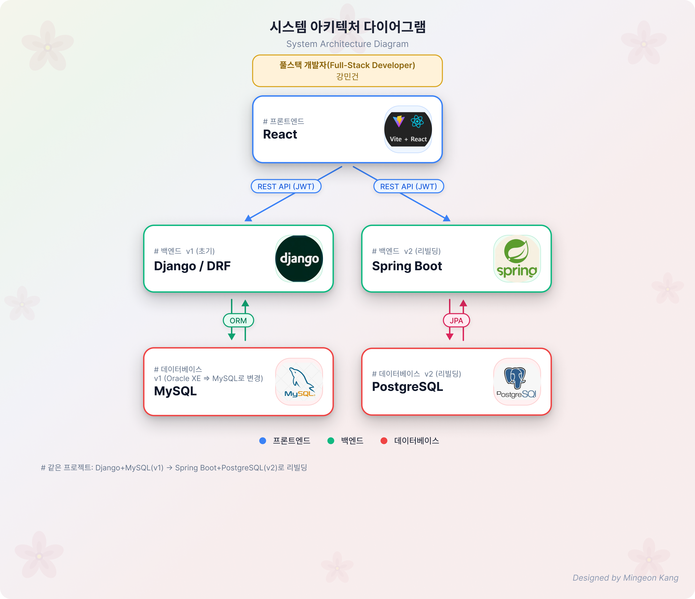
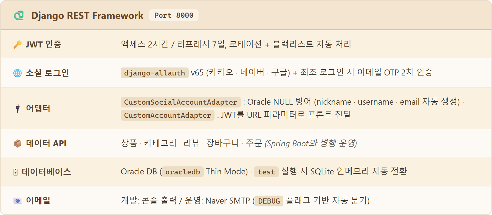
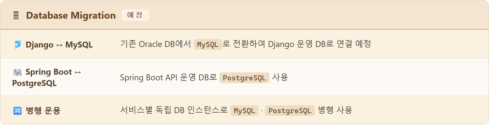

 

<h1><i>DaumAna</i></h1>

 

  <code>&nbsp; 다 움 &nbsp;</code>
  &nbsp;&nbsp;본질 · 됨됨이&nbsp;&nbsp;
  &nbsp;&nbsp;<b>✦</b>&nbsp;&nbsp;
  &nbsp;&nbsp;아나톨레 · 떠오름&nbsp;&nbsp;
  <code>&nbsp; ἀνατολή &nbsp;</code>

 

  <i>
    한국어 <b>다움</b>과 그리스어 <b>ἀνατολή</b>(아나톨레)의 합성어
     
    <b>"집의 본질(집다움)이 새벽처럼 떠오르다"</b>
  </i>

 

  <b>다움</b>은 사물이 가진 고유한 됨됨이와 진정성을 뜻합니다. 
  <b>ἀνατολή</b>는 해가 솟아오르는 새벽, 그리고 빛이 시작되는 동방(東方)을 의미합니다.  
  두 언어, 두 문화의 만남처럼 — 
  <b>집다움</b>은 한국 전통 감성이 현대적 공간 경험으로 새롭게 떠오르는 
  그 순간을 담은 플랫폼입니다.

 

  

   

  

   

### 🖼 Logo / Brand

  

  

  

&nbsp;&nbsp;&nbsp;&nbsp;

&nbsp;&nbsp;&nbsp;&nbsp;

 

한옥 지붕과 무궁화를 모티프로 한 심볼형 로고 &nbsp;·&nbsp; 라이트/다크 버전과 심볼 없는 워드마크 버전

   

  

 

<h2>🏠 프로젝트 소개</h2>

  <b>집다움</b> &nbsp;은&nbsp; <i>'집다운 집'</i>
   
  공간이 가져야 할 한국의 고유한 감성과 품격이 녹아들어간 상품을 고객과 연결하는
    
  <b>D2C 이커머스형 가구, 인테리어 플랫폼</b>입니다.

 

  브랜드가 소비자에게 직접 닿는 <b>D2C</b> 방식으로, 
  중간 유통 없이 제품의 감성과 스토리를 있는 그대로 전달합니다.

 

한국 전통 미감에서 영감을 받은 쇼룸 경험을 중심으로

  <code>React</code> &nbsp;·&nbsp;
  <code>Django</code> &nbsp;·&nbsp;
  <code>Spring Boot</code> &nbsp;·&nbsp;
  <code>Oracle DB</code> &nbsp;·&nbsp;
  <code>MySQL</code> &nbsp;·&nbsp;
  <code>PostgreSQL</code>

  을 유기적으로 연결하며 &nbsp;<code>Git · GitHub Actions</code>&nbsp; 기반 <b>DevOps</b> 워크플로우로 협업한
   
  <b>풀스택 팀 프로젝트</b>입니다.

 

  

 

## 🛠 Tech Stack

 

**🎨 Frontend**

 

 

**🛠 Backend**

 

 

**🗄 Database**

 

 
Oracle DB — Django 운영 DB (oracledb Thin Mode) &nbsp;·&nbsp; MySQL · PostgreSQL — Spring Boot 및 팀원 로컬 개발 환경

 

**🔐 Auth**

 

 

**💳 Payment**

 

**⚙️ DevOps**

 

  

 

### 🗂 Architecture Diagram

 

  

 

  <picture>
    <source media="(prefers-color-scheme: dark)" srcset="assets/tables/developer-dark.png"/>
    <source media="(prefers-color-scheme: light)" srcset="assets/tables/developer-light.png"/>
    
  </picture>

 

### 🎨 Frontend

<picture>
  <source media="(prefers-color-scheme: dark)" srcset="assets/tables/react-dark.png"/>
  <source media="(prefers-color-scheme: light)" srcset="assets/tables/react-light.png"/>
  
</picture>

 

<picture>
  <source media="(prefers-color-scheme: dark)" srcset="assets/tables/vite-dark.png"/>
  <source media="(prefers-color-scheme: light)" srcset="assets/tables/vite-light.png"/>
  
</picture>

 

---

### 🛠 Backend

<picture>
  <source media="(prefers-color-scheme: dark)" srcset="assets/tables/django-dark.png"/>
  <source media="(prefers-color-scheme: light)" srcset="assets/tables/django-light.png"/>
  
</picture>

 

<picture>
  <source media="(prefers-color-scheme: dark)" srcset="assets/tables/springboot-dark.png"/>
  <source media="(prefers-color-scheme: light)" srcset="assets/tables/springboot-light.png"/>
  
</picture>

 

  

 

### 🗄 Database &nbsp;&nbsp; 📝 예정

<picture>
  <source media="(prefers-color-scheme: dark)" srcset="assets/tables/database-dark.png"/>
  <source media="(prefers-color-scheme: light)" srcset="assets/tables/database-light.png"/>
  
</picture>

 

  

 

### 🚀 Deployment &nbsp;&nbsp; 📝 예정

  React · Django · Spring Boot 세 서비스를 각각 <b>Docker</b> 이미지로 컨테이너화하고,
   
  <b>Kubernetes</b> 클러스터 위에서 오케스트레이션하는 배포 환경을 구축할 예정입니다.

 

 

  

