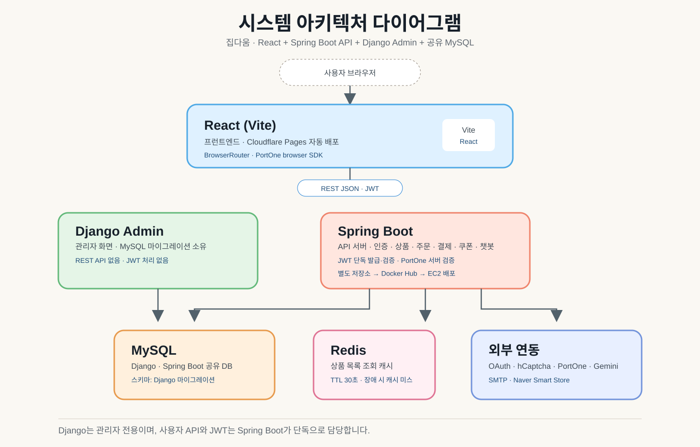
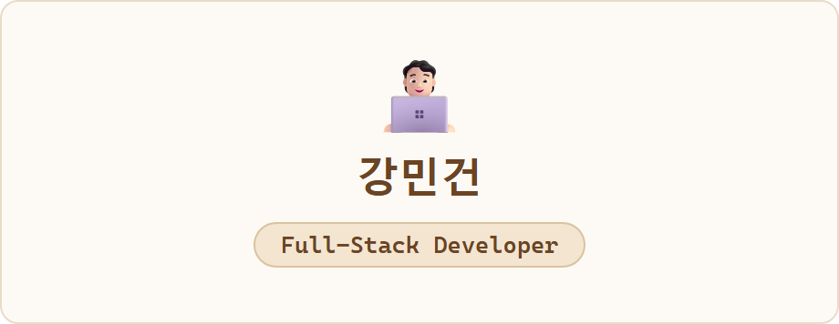
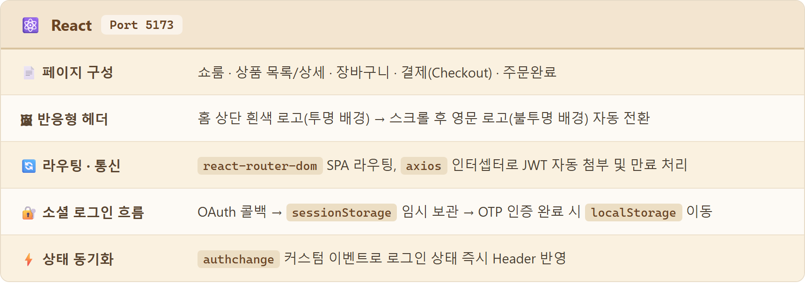
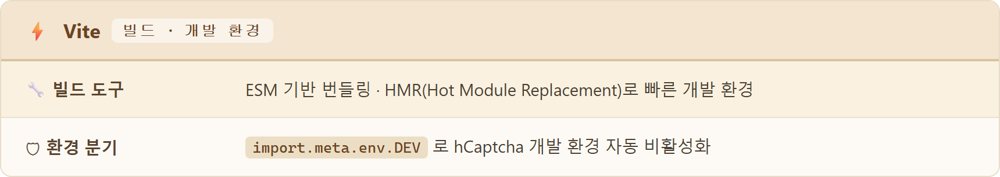
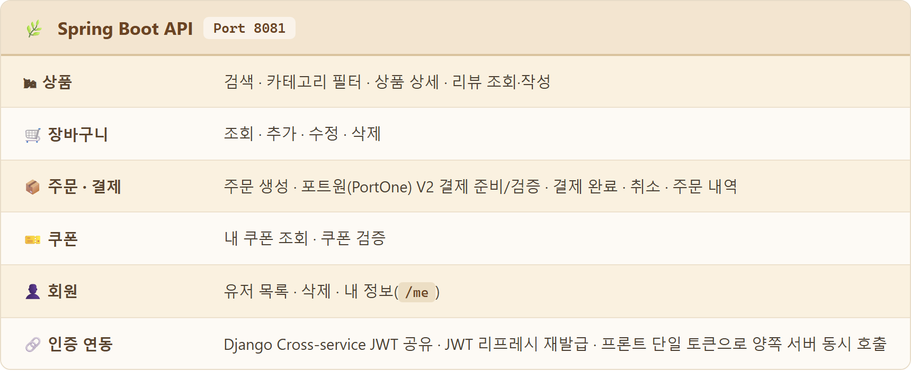
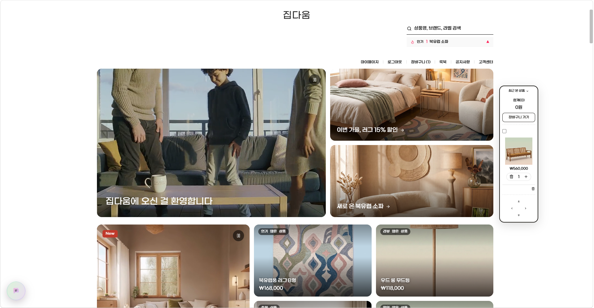
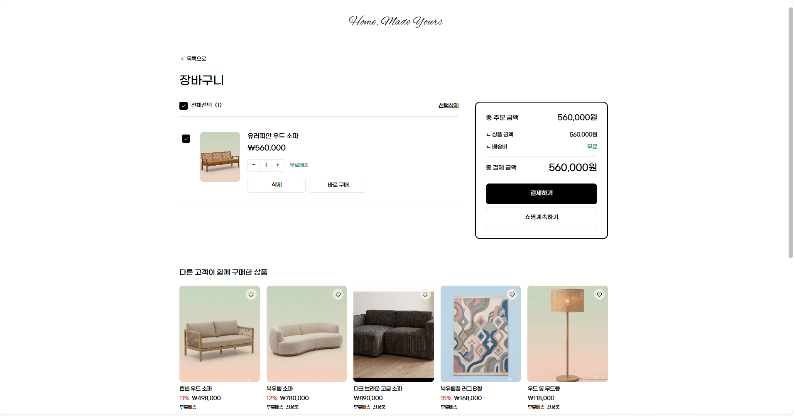
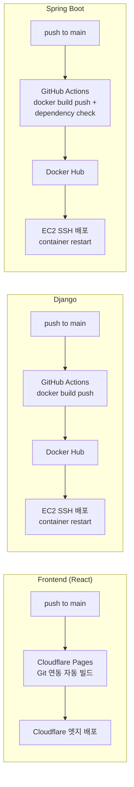

<div align="center">

<br/>

<h1><i>DaumAna</i></h1>

<br/>

<p>
  <code>&nbsp; 다 움 &nbsp;</code>
  &nbsp;&nbsp;<sup>본질 · 됨됨이</sup>&nbsp;&nbsp;
  &nbsp;&nbsp;<b>✦</b>&nbsp;&nbsp;
  &nbsp;&nbsp;<sup>아나톨레 · 떠오름</sup>&nbsp;&nbsp;
  <code>&nbsp; ἀνατολή &nbsp;</code>
</p>

<br/>

<p>
  <i>
    한국어 <b>다움</b>과 그리스어 <b>ἀνατολή</b>(아나톨레)의 합성어
    <br/>
    <b>"집의 본질(집다움)이 새벽처럼 떠오르다"</b>
  </i>
</p>

<br/>

<p>
  <b>다움</b>은 사물이 가진 고유한 됨됨이와 진정성을 뜻합니다.<br/>
  <b>ἀνατολή</b>는 해가 솟아오르는 새벽, 그리고 빛이 시작되는 동방(東方)을 의미합니다.<br/><br/>
  두 언어, 두 문화의 만남처럼 —<br/>
  <b>집다움</b>은 한국 전통 감성이 현대적 공간 경험으로 새롭게 떠오르는<br/>
  그 순간을 담은 플랫폼입니다.
</p>

<br/>

</div>

<div align="center">
  
</div>

<br/><br/><br/>

<div align="center">
  
</div>

<br/><br/><br/>

<div align="center">

### 🖼 Logo / Brand


<br/><br/>


<br/><br/>


<br/><br/>


&nbsp;&nbsp;&nbsp;&nbsp;

&nbsp;&nbsp;&nbsp;&nbsp;


<br/>

<sub>한옥 지붕과 무궁화를 모티프로 한 심볼형 로고 &nbsp;·&nbsp; 라이트/다크 버전과 심볼 없는 워드마크 버전</sub>

<br/><br/>


<br/>

<sub>헤더·로그인 화면 등에 함께 쓰이는 이니셜 심볼 &nbsp;·&nbsp; "J.D"(Jipdaum)</sub>

<br/><br/>


<br/><br/>


<br/>

<sub>간결한 한글 워드마크를 중심으로 한 3차 프로젝트 로고</sub>

</div>

<br/><br/><br/>

<div align="center">
  
</div>

<br/>

<div align="center">

<h2>🏠 프로젝트 소개</h2>

<p>
  <b>집다움</b> &nbsp;은&nbsp; <i>'집다운 집'</i>
  <br/>
  공간이 가져야 할 한국의 고유한 감성과 품격이 녹아들어간 상품을 고객과 연결하는
  <br/><br/>
  <b>D2C 이커머스형 가구, 인테리어 플랫폼</b>입니다.
</p>

<br/>

<p>
  브랜드가 소비자에게 직접 닿는 <b>D2C</b> 방식으로,<br/>
  중간 유통 없이 제품의 감성과 스토리를 있는 그대로 전달합니다.
</p>

<br/>

<p>한국 전통 미감에서 영감을 받은 쇼룸 경험을 중심으로</p>

<p>
  <code>React</code> &nbsp;·&nbsp;
  <code>Django</code> &nbsp;·&nbsp;
  <code>Spring Boot</code> &nbsp;·&nbsp;
  <code>MySQL</code>
</p>

<p>
  을 유기적으로 연결하며 &nbsp;<code>Git · GitHub Actions</code>&nbsp; 기반 <b>DevOps</b> 워크플로우로 협업한
  <br/>
  <b>풀스택 팀 프로젝트</b>입니다.
</p>

</div>

<br/>

<div align="center">
  
</div>

<br/>

<div align="center">

<h2>💡 개발 동기</h2>

<p>
  단순한 CRUD 예제가 아니라, <b>실제 서비스에 가까운 이커머스</b>를 처음부터 끝까지 직접 만들어보고 싶었습니다.
  <br/>
  회원가입 · 로그인, 상품 탐색, 장바구니, 결제, 리뷰까지 — 쇼핑몰 하나가 굴러가기 위해 필요한
  <br/>
  모든 흐름을 스스로 설계하고 구현하며 <b>풀스택 개발 역량</b>을 다지는 것이 목표였습니다.
</p>

<br/>

<p>
  <code>React</code>(프론트) · <code>Spring Boot</code>(회원 · 상품 · 주문 · 결제 API) · <code>Django</code>(관리자 화면 · MySQL 스키마 마이그레이션)로
  <br/>
  <b>서로 다른 두 백엔드를 하나의 서비스로 연결</b>하는 구조를 일부러 선택했습니다.
  <br/>
  실무에서 흔히 겪는 <b>다중 서버 간 인증 연동, 데이터 정합성</b> 같은 문제를 직접 부딪혀보기 위해서입니다.
</p>

<br/>

<p>
  그 위에 <b>한국 전통의 미감</b>을 담은 가구 · 인테리어라는 구체적인 주제를 얹어,
  <br/>
  기술만 나열하는 프로젝트가 아니라 <b>완성도 있는 하나의 브랜드 경험</b>으로 보여주고자 했습니다.
</p>

</div>

<br/>

<div align="center">
  
</div>

<br/>

<div align="center">

## 🛠 Tech Stack

<br/>

**🎨 Frontend**

| | 기술 | 설명 |
|---|---|---|
|  | React 19 | 컴포넌트 기반 SPA UI |
|  | Vite | 개발 서버 · 번들러 (HMR) |
|  | React Router | 클라이언트 라우팅(SPA 페이지 전환) |
|  | Axios | Spring Boot API 호출(인터셉터로 JWT 자동 첨부·만료 처리) |
|  | Lenis | 스무스 스크롤(전역 휠 이벤트 인터셉트) |

<br/>

**🛠 Backend**

| | 기술 | 설명 |
|---|---|---|
|  | Django | 관리자 화면(admin) 전용 — REST API 없음, MySQL 스키마는 계속 이쪽 마이그레이션이 소유 |
|  | Spring Boot | 회원가입 · 로그인(소셜 포함) · 장바구니 · 주문 · 결제 · 쿠폰 · 챗봇 등 API 전부 전담(별도 저장소 `jipdaum-spring`) |
|  | Spring Security | OAuth2 클라이언트, 인증/인가 필터 체인 |
|  | Spring Data JPA | 엔티티 매핑, 원자적 조건부 UPDATE 쿼리(재고 · 쿠폰 동시성 제어), `ddl-auto: none`(스키마는 Django가 소유) |
|  | JWT | Spring Boot가 발급 · 검증 전담(Django는 API가 없어 JWT를 다루지 않음) |

<br/>

**🤖 AI 챗봇**

| | 기술 | 설명 |
|---|---|---|
|  | Gemini API | `gemini-3.6-flash` 대화 + `gemini-embedding-001` 기반 RAG 의미 검색, 함수 호출로 상품 추천 |
|  | Bucket4j | IP · 계정 단위 챗봇 API 요청 제한 |
|  | Caffeine | 인메모리 캐시(Rate-limit 버킷 보관) |

<br/>

**🗄 Database**

| | 기술 | 설명 |
|---|---|---|
|  | MySQL (Docker) | Django · Spring Boot 공용 DB, 스키마는 Django 마이그레이션이 소유(`ddl-auto: none`) |
|  | Redis (Docker) | Spring Boot 상품 목록 조회 캐시(TTL 30초) — Spring 관리자 API 변경 시 즉시 무효화, Django Admin 직접 변경은 최대 30초 내 반영; 장애 시 캐시 미스로 자동 우회 |

<br/>

**🔐 Auth**

| | 기술 | 설명 |
|---|---|---|
|  | Google OAuth2 | 소셜 로그인 |
|  | Kakao OAuth2 | 소셜 로그인 |
|  | Naver OAuth2 | 소셜 로그인 |
|  | hCaptcha | 회원가입 · 로그인 봇 방지 캡차 |

<br/>

**💳 Payment**

| | 기술 | 설명 |
|---|---|---|
|  | PortOne V2 | 결제 연동 — 프론트(browser-sdk) 요청 뒤 Spring Boot가 API Secret으로 금액·상태를 검증 |

<br/>

**⚙️ DevOps**

| | 기술 | 설명 |
|---|---|---|
|  | Git | 형상 관리 |
|  | GitHub | 저장소 3개(프론트+Django / Spring Boot / 포트폴리오) 관리 |
|  | GitHub Actions | Django · Spring Boot CI/CD(Docker Hub 빌드 → EC2 배포) |
|  | Docker | Django · Spring Boot 컨테이너화 배포 단위 |
|  | Amazon EC2 | Django · Spring Boot 컨테이너 호스팅 |
|  | Cloudflare Pages | 프론트엔드 Git 연동 자동 빌드 · 배포 |

</div>

<br/>

<div align="center">
  
</div>

<br/>

<div align="center">

### 🗂 Architecture Diagram



<sub>React는 Spring Boot API만 호출합니다. Django는 관리자 화면과 MySQL 마이그레이션을 담당하며 REST API와 JWT 처리에는 관여하지 않습니다.</sub>

</div>

<br/>

<div align="center">
  
</div>

<br/>

<div align="center">
  <picture>
    <source media="(prefers-color-scheme: dark)" srcset="assets/tables/developer-dark.png"/>
    <source media="(prefers-color-scheme: light)" srcset="assets/tables/developer-light.png"/>
    
  </picture>
</div>

<br/>

<div>

### 🎨 Frontend

<picture>
  <source media="(prefers-color-scheme: dark)" srcset="assets/tables/react-dark.png"/>
  <source media="(prefers-color-scheme: light)" srcset="assets/tables/react-light.png"/>
  
</picture>

<br/>

<picture>
  <source media="(prefers-color-scheme: dark)" srcset="assets/tables/vite-dark.png"/>
  <source media="(prefers-color-scheme: light)" srcset="assets/tables/vite-light.png"/>
  
</picture>

</div>

<br/>

---

<div>

### 🛠 Backend

**Django** &nbsp;`admin 전용 · Port 8000`

| | |
|---|---|
| 🛠 **관리자 화면** | Users · Products · Orders · payments · coupons 모델을 admin에서 관리 |
| 🚫 **API** | 없음 — 회원 · 상품 · 주문 · 결제 · 쿠폰 · 챗봇 API는 전부 Spring Boot(`jipdaum-spring`)로 이관 완료 |
| 🗄 **스키마 소유** | MySQL 마이그레이션을 Django가 전담 — Spring Boot의 JPA는 `ddl-auto: none`으로 스키마에 손대지 않음 |
| 🧪 **테스트** | `test` 실행 시 SQLite 인메모리로 자동 전환 |

<br/>

<picture>
  <source media="(prefers-color-scheme: dark)" srcset="assets/tables/springboot-dark.png"/>
  <source media="(prefers-color-scheme: light)" srcset="assets/tables/springboot-light.png"/>
  
</picture>

<sub>⚠️ 위 표는 회원가입/로그인·이메일 인증·챗봇·웰컴 쿠폰 자동 지급·Redis 캐시가 추가되기 전 버전입니다. 실제로는 "회원" 항목에 회원가입 · 로그인(소셜 포함) · 이메일 인증 · 탈퇴가, "쿠폰"에 신규가입 웰컴 쿠폰 자동 지급이, "인증 연동"에는 Spring Boot 단독 발급·검증(Django는 관여하지 않음)이 포함되고, 챗봇 API(Gemini 연동)도 별도로 있습니다.</sub>

</div>

<br/>

<div align="center">
  
</div>

<br/>

<div align="center">

### 🗄 Database

| | |
|---|---|
| 🐬 **MySQL (Docker)** | `Oracle → MySQL` 전환 완료(2026-07) · Django · Spring Boot가 하나의 DB를 공유 |
| ⚡ **Redis (Docker)** | Spring Boot 상품 목록 조회 캐시(TTL 30초) · Spring 관리자 API 변경 시 즉시 무효화, Django Admin 직접 변경은 최대 30초 내 반영 · `jibdaum-redis` 컨테이너 장애 시 캐시 미스로 우회 |
| 🔗 **연동** | `docker compose up -d`로 로컬 컨테이너(`jibdaum-mysql`, `jibdaum-redis`) 기동, PC마다 `.env`만 새로 생성하면 동일 스키마 공유 |

</div>

<br/>

<div align="center">
  
</div>

<br/>

<div align="center">

### 📌 최근 작업 사항

<sub>자세한 변경 내역은 <code>#Developer_Document/frontend_developer/</code>에 작업 단위별로 문서화되어 있습니다.</sub>

<br/><br/>

| 구분 | 내용 |
|---|---|
| 🛍 카탈로그 | 한국관 폐지, 룩북(오늘의집 스타일 상품 피드 + 핀 위젯) 신설 — 상품 상세페이지는 `/item/:id` 하나로 통일 |
| 🧭 상품 상세 | 카테고리 브레드크럼 표시, 컬러 옵션이 있는 상품은 드롭다운으로 옵션·수량 선택 후 구매 |
| 🎟 웰컴 쿠폰 | 회원가입 시 웰컴 쿠폰 자동 지급(Spring Boot) — Django에 결제 적용용 일반 쿠폰 10종 시드 |
| ⚡ 캐싱 | Spring Boot 상품 목록 조회에 Redis 캐시 적용(TTL 30초) — Spring 관리자 API 변경은 즉시 무효화, Django Admin 직접 변경은 TTL 내 반영 |
| 💳 결제 안정성 | PortOne 결제 검증에 결제 행 잠금을 적용하고, 옵션 소속 검증·재고 원자 차감·쿠폰 복구·무결제 주문 처리를 보완 |
| 🚀 성능 최적화 | PNG를 JPEG로 경량화하고 Hero 모바일 저용량 영상·라우트 코드 분할을 적용해 초기 로드 비용 축소 |
| 🧭 네비게이션 | 상세 → 목록 뒤가기 시 인트로를 건너뛰고 원래 스크롤 위치로 즉시 복귀 |
| 📜 법적 고지 | 전자상거래법상 사업자 정보 표시 패널(BusinessInfoPanel) 신설 |
| 📱 반응형 | 로그인/회원가입/챗봇/사이드바 모바일 레이아웃 및 터치 스크롤 대응 |
| ☁️ 배포 | 프론트엔드 배포를 EC2 → Cloudflare Pages(Git 자동 배포)로 전환 |

</div>

<br/>

<div align="center">
  
</div>

<br/>

<div align="center">

### 🚀 Deployment

| | |
|---|---|
| 🎨 **Frontend (React)** | **Cloudflare Pages** — 저장소 Git 연동, `main` 푸시마다 자동 빌드/배포 (Root `frontend`, Build `npm run build`, Output `dist`) |
| 🛠 **Django** | 이 저장소 `main` 푸시 → **Docker** 이미지 빌드 → Docker Hub → **EC2** 컨테이너 배포 |
| ☕ **Spring Boot** | 별도 저장소 `jipdaum-spring`의 `main` 푸시 → Docker Hub → EC2 컨테이너 배포 |

<br/>


</div>

<br/>

<div align="center">
  
</div>

<br/>

<div align="center">

### 📸 화면



<sub>메인 페이지 — Hero 영상, 프로모션 배너, 상품 피드, 검색과 최근 본 상품·장바구니 위젯</sub>

<br/><br/>



<sub>장바구니 — 선택·수량 변경·즉시 구매, 주문 금액 요약과 함께 구매하는 상품 추천</sub>

</div>

<br/>

<div align="center">
  
</div>

<br/>

<div align="center">

### 🧩 Core Features

| 영역 | 기능 |
|---|---|
| 🔐 인증 | 이메일 회원가입(OTP 인증) · 소셜 로그인(카카오·네이버·구글) · JWT(Spring Boot 단독 발급·검증) |
| 🛍 상품 | 단일 카탈로그(`/item/:id`), 카테고리 브레드크럼, 컬러 옵션 드롭다운(옵션·수량 선택 후 구매), 사이드바 검색 |
| 📷 룩북 | 오늘의집 스타일 상품 피드 + 이미지 핀 위젯, 게시물 상세 페이지 |
| 🛒 장바구니 · 주문 | 장바구니 CRUD, 주문 생성, 최근 본 상품(macOS 독 스타일 위젯) |
| 💳 결제 | PortOne V2 결제 준비·검증·완료, 결제 검증 시 비관적 잠금; 결제 시작 전 PENDING 주문만 취소하며 재고·쿠폰 복구 |
| 🎟 쿠폰 | 회원가입 시 웰컴 쿠폰 자동 지급, 조회 · 적용은 원자적 조건부 UPDATE로 동시 사용 시 초과 차감 방지 |
| 📦 재고 | 조건부 UPDATE(`stockCount >= qty`)로 동시 주문 시 오버셀 방지 |
| ⚡ 캐싱 | Redis 상품 목록 조회 캐시(TTL 30초), Spring 관리자 API 변경 시 즉시 무효화; Django Admin 직접 변경은 TTL 내 반영, 장애 시 캐시 미스로 자동 우회 |
| 🤖 AI 챗봇 | Gemini 기반 상담 — 임베딩(`gemini-embedding-001`) 코사인 유사도 검색 + 함수 호출로 상품 추천 |
| 👤 마이페이지 | 주문 내역, 리뷰 작성, 회원 정보 관리 |
| 🛠 관리자 | Django Admin — 상품 · 카테고리 · 쿠폰 · 회원 관리(API는 없음, admin 전용) |
| 📱 반응형 | 로그인/회원가입/챗봇/사이드바 모바일 레이아웃 대응 |

</div>

<br/>

<div align="center">
  
</div>

<br/>

<div align="center">

### 🚀 Quick Start

</div>

1. **MySQL · Redis 컨테이너 기동** — 저장소 루트에서 `docker compose up -d` (`jibdaum-mysql` 3306 · `jibdaum-redis` 6379)
2. **`backend/.env` 생성** — `backend/.env.example`을 복사해 값 채우기
3. **`frontend/.env` 생성** — `frontend/.env.example`을 복사해 PortOne·hCaptcha 키 채우기
4. **`jipdaum-spring` 별도 클론** — `application.yml.example`을 복사해 `application.yml` 생성. `jwt.secret`은 Spring Boot 전용이므로 Django `SECRET_KEY`와 공유하지 않음
5. **각자 실행**
   ```bash
   # Django (backend/)
   python manage.py runserver          # :8000

   # React (frontend/)
   npm install && npm run dev          # :5173

   # Spring Boot (jipdaum-spring/)
   ./mvnw spring-boot:run              # :8081
   ```

상세 절차는 [`CLAUDE.md`](CLAUDE.md), 서비스별 세부 사항은 각 저장소의 `README.md` 참고.

<br/>

<div align="center">
  
</div>

<br/>

<div align="center">

### 🔁 CI/CD Pipeline

</div>



프론트·Django는 이 저장소의 `main` 푸시를 기준으로 각각 Cloudflare Pages와 GitHub Actions 파이프라인이 동작한다. Spring Boot는 별도 `jipdaum-spring` 저장소의 `main` 푸시가 Docker Hub·EC2 배포를 별도로 트리거한다.

<br/>

<div align="center">
  
</div>

<br/>

<div align="center">

### 🗺 Development Roadmap

</div>

| 상태 | 내용 |
|---|---|
| ✅ 완료 | 상품 상세 디자인 통일 · 네비게이션 스크롤 복귀 · 전자상거래법 사업자 정보 패널 · 반응형 · Cloudflare Pages 전환 · 이미지 경량화 · Hero 모바일 영상 · 라우트 코드 분할 |
| 🟡 진행중 | README/발표 자료 보강(스크린샷 · 아키텍처 문서화) |
| 🔵 계획 | PortOne 웹훅 검증 · 승인 완료 결제 환불 API · 체크아웃 플로우 ErrorBoundary · 챗봇 임베딩 인덱스를 활용한 취향 기반 추천 노출 |

<br/>

<div align="center">
  
</div>

<br/>

<div align="center">

### 🔎 Engineering Principles

</div>

| 원칙 | 내용 |
|---|---|
| 코딩 전에 먼저 생각하기 | 가정을 숨기지 않고 드러내며, 여러 해석이 갈리면 임의로 하나를 골라 진행하지 않는다 |
| 단순함 우선 | 요청한 것 이상의 기능 · 추상화 · 설정 옵션을 만들지 않는다(YAGNI) |
| 외과수술식 변경 | 요청과 무관한 인접 코드는 건드리지 않고, 기존 스타일을 따른다 |
| 목표 지향적 실행 | 모든 작업을 검증 가능한 기준으로 바꾼다("버그 수정"이 아니라 "재현 테스트 작성 후 통과") |

<br/>

<div align="center">
  
</div>

<br/>

<div align="center">

### 📄 License & Notice

**No License — All Rights Reserved**

이 저장소는 별도의 오픈소스 라이선스를 지정하지 않았습니다.
저장소가 공개되어 있다는 사실이 코드 사용을 허가한다는 뜻은 아니며,
저작권자의 사전 서면 동의 없이 무단으로 복제 · 배포 · 수정하거나
상업적 목적으로 이용할 수 없습니다.

> Copyright &copy; 2026 집다움(JIPDAUM). All rights reserved.

상품 이미지 · 브랜드 자산은 발표 · 학습 목적의 목업이며 실제 판매 상품이 아닙니다.

</div>
