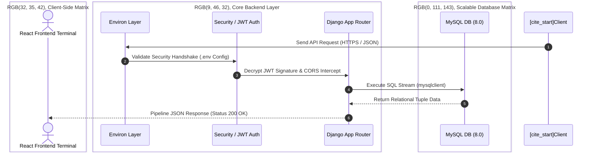

# ⚙️ JIPDAUM - Core Backend System
> **TEAM CTRL-ALT-ELITE** | 2026 데브옵스 프로젝트 (Backend Engineering)
> Robust, Scalable, and Future-Oriented API Server powered by Django & MySQL.

  

 

## 🪐 System Matrix & Core Tech Stacks
[cite_start]**JIPDAUM** 인프라의 핵심 엔진과 고신뢰성 데이터 처리를 담당하는 핵심 레이어 스택입니다.

* [cite_start]**Core Engine:** Python 3.14+ & Django Framework (v6.0.5) 
* [cite_start]**API Architecture:** Django REST Framework (DRF) 
* [cite_start]**Cryptographic Auth:** `djangorestframework-simplejwt` (Next-Gen JWT Signing) 
* [cite_start]**Data Layer Interface:** `mysqlclient` (MySQL 공식 C 드라이버 기반 커넥터) 
* [cite_start]**Security Middleware:** `django-cors-headers` (CORS 에러 해결) & `django-environ` 

 

## 🏗️ Advanced Data Flow Architecture
[cite_start]프런트엔드의 비동기 API 요청이 시큐리티 파이프라인을 거쳐 데이터 시퀀스로 격리 및 최적화되는 미래지향적 아키텍처 흐름입니다.

🚀 Deployment & Installation Matrix

0. Database Container (Docker MySQL)
Django를 띄우기 전에 MySQL 8.0 컨테이너부터 기동합니다. 데이터는 볼륨에 영속화되어 컨테이너를 내렸다 올려도 유지됩니다.

# 프로젝트 루트에서 실행
$ docker compose up -d

1. Isolated Virtual Environment Setup
시스템 의존성의 완전한 격리를 위해 가상환경을 구축하고 운영체제별 커널에 맞춰 런타임을 활성화합니다.

# 가상환경 바이너리 생성 (최초 1회)
$ python -m venv venv

# 가상환경 활성화 (Windows Environment)
$ source venv/Scripts/activate

# 가상환경 활성화 (Mac / Linux Environment)
$ source venv/bin/activate

2. Dependency Injection (pip)백엔드 커널 구동을 위한 패키지 스트리밍 아키텍처를 순차적으로 인젝션합니다.  

💡 Core Database Connector Guide: MySQL 공식 C 드라이버 기반의 `mysqlclient`를 사용하여 
                                  안정적인 DB 연동을 구현했습니다.  

# [Phase A] 핵심 웹 커널 및 API 레이어 배포
(venv) $ pip install django djangorestframework

# [Phase B] 분산 보안 게이트웨이 및 암호화 모듈 구성
(venv) $ pip install djangorestframework-simplejwt django-cors-headers django-environ

# [Phase C] MySQL 데이터베이스 드라이버 연결
(venv) $ pip install mysqlclient

# [Phase D] 형상 관리 동기화 (전체 의존성 트리 검증)
(venv) $ pip install -r requirements.txt

3. Database Schema & Test Synchronization내부 ORM 데이터 모델을 MySQL 데이터 시퀀스 매트릭스와 동기화하고, 
인메모리 테스트 환경을 검증합니다.  

# 마이그레이션 파일 생성 및 데이터베이스 반영
(venv) $ python manage.py makemigrations
(venv) $ python manage.py migrate

⚙️ Automated SQLite Test Switching: 'test' 명령어가 실행 중일 때만 데이터베이스 설정을 MySQL에서 SQLite로 스위칭하여, 
   메모리 상에 임시로 데이터 세트를 생성했다가 테스트 종료 시 자동으로 소멸시키는 무중단 검증 메커니즘이 포함되어 있습니다.  

🌐 Internationalization & Time Vector글로벌 스탠다드 및 국내 서비스 운영을 위해 런타임 메트릭스를 대한민국 표준 설정으로 동기화합니다.  
LANGUAGE_CODE = 'ko-kr': 장고 관리자(Admin) 페이지 인터페이스 전면 한글화 지원.  
TIME_ZONE = 'Asia/Seoul': 모든 데이터 비즈니스 로직의 타임스탬프를 한국 표준시(KST)로 일치화.  
🔒 Security Policy & Environment Vectors (.env)시스템의 암호화 키벡터(SECRET_KEY) 및 
MySQL 인프라 엔드포인트는 외부 저장소에 하드코딩되지 않고 철저히 은닉되어 처리됩니다. 
최상위 루트 디렉토리에 환경 구성 변수를 구축하십시오.  

# =================================================================
# SYSTEM ENVIRONMENT CONFIGURATION VECTORS (JIPDAUM)
# =================================================================
SECRET_KEY=여기에_장고_시크릿키_입력
DEBUG=True

# DATABASE MATRIX CONFIGURATION — docker-compose.yml의 MySQL 컨테이너 기본값과 일치 (Do NOT include inline comments here)
DB_NAME=jibdaum
DB_USER=root
DB_PASSWORD=rootpassword
DB_HOST=127.0.0.1
DB_PORT=3306

⚠️ Database Test Vector: 내부 테스트 프레임워크(python manage.py test) 구동 시, 데이터 무결성 보장을 위해 
MySQL 컨테이너와 완전히 격리된 SQLite 인메모리 DB로 자동 전환되어 안전하게 샌드박싱 테스트가 수행됩니다.

# 0. 데이터베이스 컨테이너 실행 (Docker)
프로젝트 루트에서 MySQL 8.0 컨테이너를 먼저 띄웁니다.

$ docker compose up -d

# 1. 가상환경 생성 및 활성화 (Virtual Environment)
프로젝트 루트 디렉토리에서 의존성 충돌을 방지하기 위해 가상환경을 먼저 활성화.

가상환경 생성 (최초 1회) : 
$ python -m venv venv

가상환경 활성화 (Windows) : 
$ source venv/Scripts/activate

# 2. 패키지 설치 (Dependency Installation)
구동에 필요한 핵심 패키지 및 라이브러리를 순차적으로 설치.

💡 MySQL 공식 C 드라이버 기반의 `mysqlclient`를 사용해 안정적인 DB 연동을 구현.

1. 필수 프레임워크 및 DRF 설치 : 
(venv) $ pip install django djangorestframework

2. JWT 인증 및 CORS 미들웨어 설치 : 
(venv) $ pip install djangorestframework-simplejwt django-cors-headers

3. MySQL 데이터베이스 커넥터 설치 : 
(venv) $ pip install mysqlclient

4. 전체 의존성 리스트 백업/확인 (선택 사항) : 
(venv) $ pip install -r requirements.txt

5. 전체 의존성 리스트 백업/확인 (선택 사항) : 
(venv) $ pip install django-environ

# 3. 데이터베이스 마이그레이션 (Database Migration)
MySQL DB 스키마와 Django ORM 모델을 동기화.

마이그레이션 파일 생성 : 
(venv) $ python manage.py makemigrations

DB에 변경사항 적용 : 
(venv) $ python manage.py migrate

# 4. 개발 서버 구동 (Run Server)
로컬 개발 서버를 실행. 기본적으로 http://127.0.0.1:8000/에서 대기.

(venv) $ python manage.py runserver

